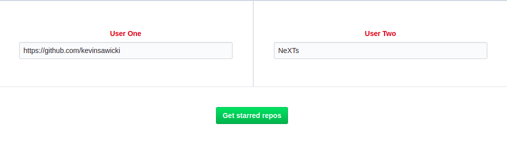
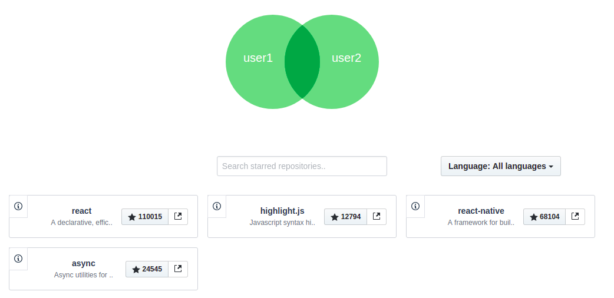
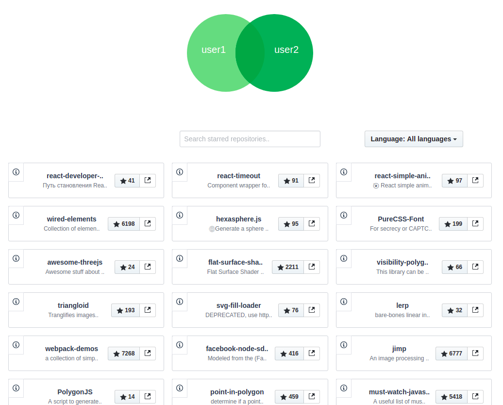
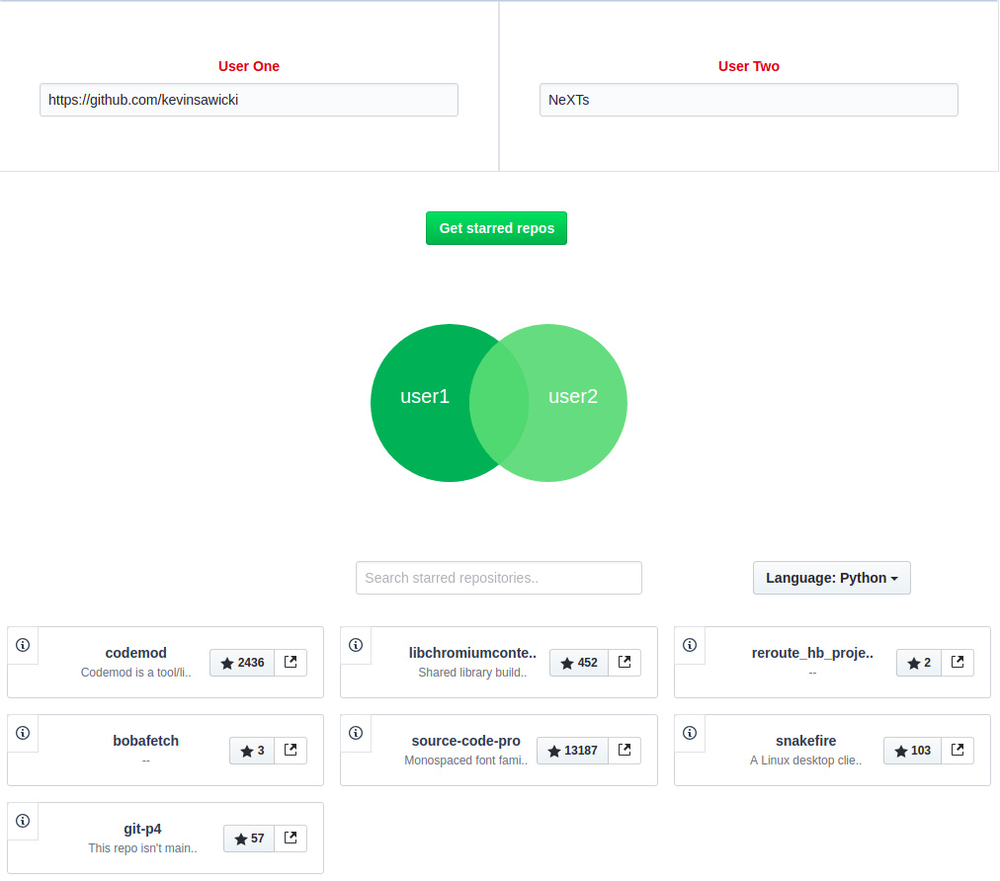

# Gitrahub

> A Github based project. `Gitrahub` stands for 'Git Intra Hub'. Main goal of gitrahub is you can easily find the sharred interest between two users. Follow the below steps and run it locally. 


## Demo


## How it works

You can either provide github profile url or username in the respective input fields like in the below image. In this case i gave profile url to the first input field and profile name to the second input field.

# 

So after clicking the `Get starred repos` button you will get the mutual starred repos of the two users.

# 

Incase you want to find the individual starred repos of particular user you can select areas in the venn diagram like below images. So Let's start play with gitrahub.

# 
# 

## Some Constraints 

GitHub limits unauthenticated API requests to 60 per hour but after binding your access token you will be able to enjoy the rate limit of 5,000 requests per hour.

## Installation

``` bash
# install dependencies
npm install

# serve with hot reload at localhost:8080
npm run dev

# build for production with minification
npm run build

# build for production and view the bundle analyzer report
npm run build --report
```

## Credits

R. Vivek ([@vividvilla](https://github.com/vividvilla))
